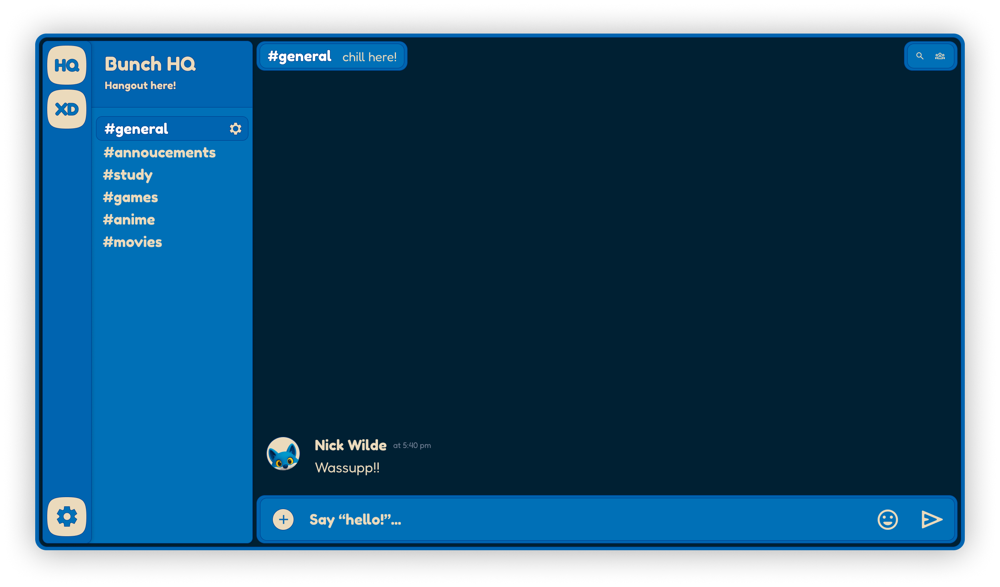

# Bunch

Bunch is a cross-platform real-time group chat application.

## Project Structure

This project is a monorepo that includes a Next.js frontend and a Django backend.

- **Frontend:** The frontend is built with Next.js. More information can be found in [apps/web/bunch/README](./apps/web/bunch/README.md).
- **Backend:** The backend (orchard) is built with Django. More information can be found in [server/README](./server/README.md).

## Getting Started

Setup instructions for the frontend and backend are available in their respective README files:

- [Frontend (Next.js)](./apps/web/bunch/README.md)
- [Backend (Django)](./server/README.md)

## Contributing

We welcome contributions to improve and expand Bunch. If you have new features or find improvements, please follow these steps:

1.  Fork the repository.
2.  Create a new branch.
3.  Make your changes, including clear comments and tests (if applicable).
4.  Submit a pull request for review.
